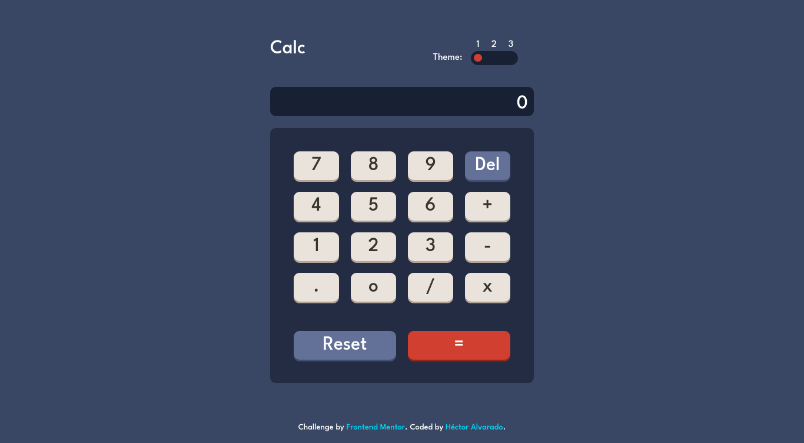

# Frontend Mentor - Calculator app solution

This is a solution to the [Calculator app challenge on Frontend Mentor](https://www.frontendmentor.io/challenges/calculator-app-9lteq5N29). Frontend Mentor challenges help you improve your coding skills by building realistic projects. 

## Table of contents

- [Overview](#overview)
  - [The challenge](#the-challenge)
  - [Screenshot](#screenshot)
  - [Links](#links)
- [My process](#my-process)
  - [Built with](#built-with)
  - [What I learned](#what-i-learned)
  - [Useful resources](#useful-resources)
- [Author](#author)

## Overview

### The challenge

Users should be able to:

- See the size of the elements adjust based on their device's screen size
- Perform mathmatical operations like addition, subtraction, multiplication, and division
- Adjust the color theme based on their preference

### Screenshot



### Links

- Solution URL: [github repository](https://github.com/HECTORalvarado/Calculator-App)
- Live Site URL: [here](https://hectoralvarado.github.io/Calculator-App/)

## My process

### Built with

- Semantic HTML5 markup
- CSS Grid
- JavaScript
- JS local Storage

### What I learned

In this project, I learned how to avoid the user selection of a text using css, and how to style a range input.
```css
.nonSelectableText {
  user-select:none;
}
```
And a new way to delete the last character of a string
```js
let newString = screenPad.textContent.slice(0, -1, screenPad.length);
```

### Useful resources

- [range-input css generator](https://range-input-css.netlify.app/) - This helped me for style to a range input 


## Author

- Website - [Hector Alvarado](https://www.hectoralvarado.github.io)
- Frontend Mentor - [@HECTORalvarado](https://www.frontendmentor.io/profile/HECTORalvarado)
- Twitter - [@hector_527](https://www.twitter.com/hector_527)
